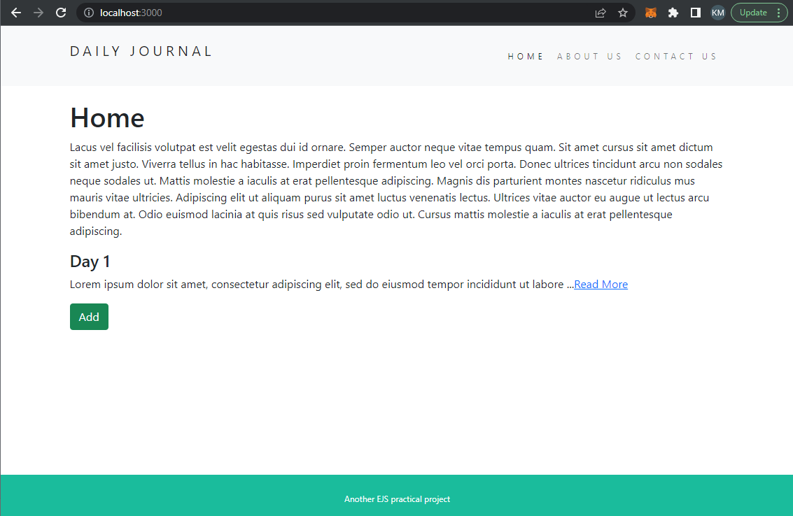
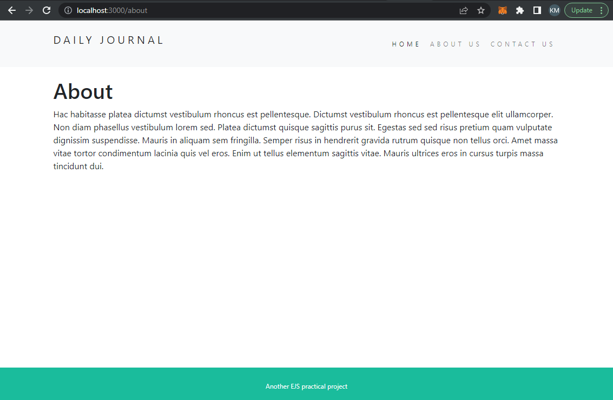
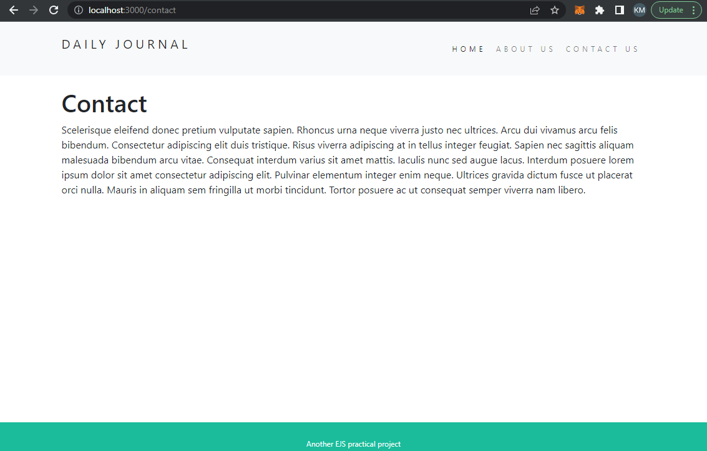
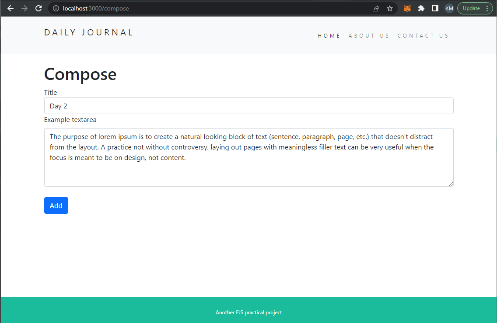
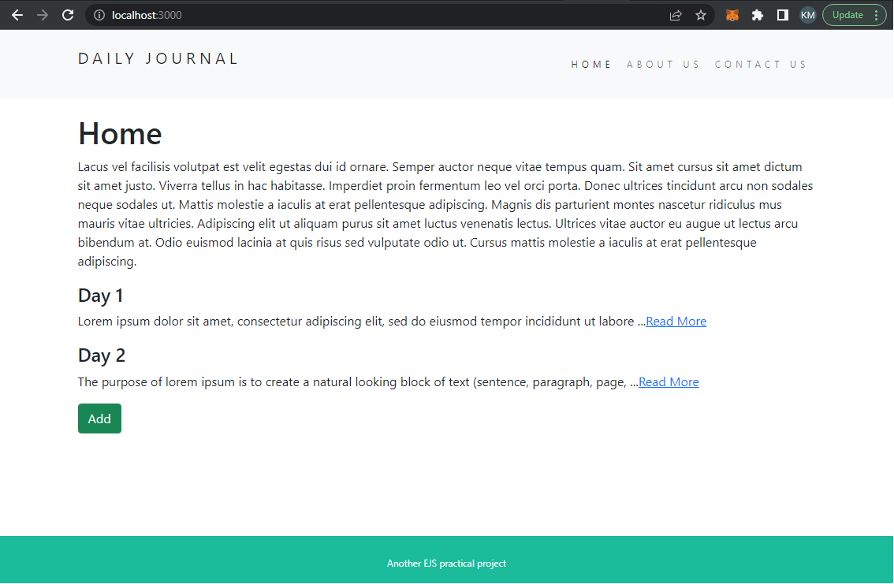
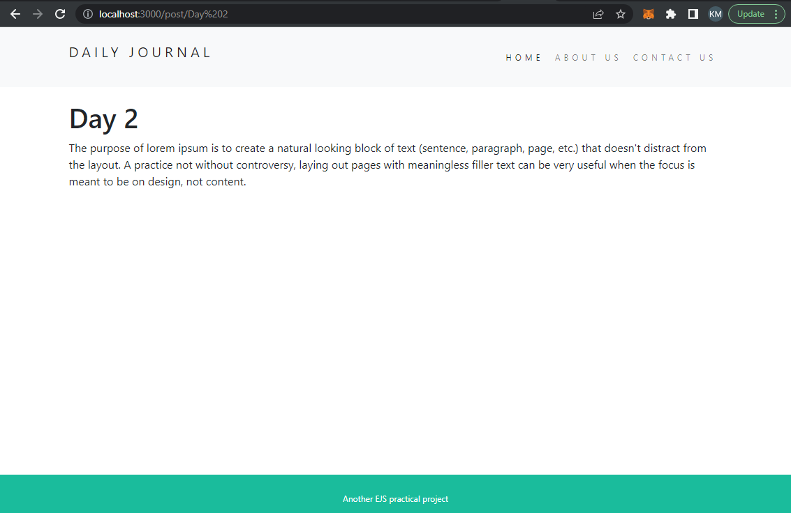

# EJS blog website
[What the project does](#project-description)
[Technology Involved](#technologies-involved)
[Usage](#usage)
[Lesson Learned](#lesson-learned)
[Preview](#preview)

# Project Description
- A simple express web server that implement EJS as page template
- The webpage allow user to compose a simple blog with content
- The homepage of the website will show the first 100 letters of blogs post
- The post page will show the whole content of the post

# Technologies Involved
- Express: ^4.16.3
- Node: ^14.17.6
- ejs: ^3.1.8
- lodash: ^4.17.21
- mongoose: ^6.6.1

# Usage
1. Install dependencies: `npm install`
2. Run server: `note app.js`
3. Create a mongoDB Atlas account
4. Connect to your database via mongoose with the URI of your database (remember to change the information of username,password,clustername and password accordingly)
```
mongoose.connect("mongodb+srv://<username>:<password>@<clustername>.mongodb.net/<databasename>?w=majority");
```
    - Your should be able to get a customized URI from your account
    - For more detailed information and documentation, please visit mongoDB doc website mongoDB/docs

# Lesson Learned
- Implement EJS template page to simplify the web development process
- Passing variables through express
- Use express route parameters for useful purposes.

# Update
- Add connection to mongodb Atlas

# Preview
- Homepage



- About page



- Contact page



- Compose post page



- Homepage (After)



- Post page


