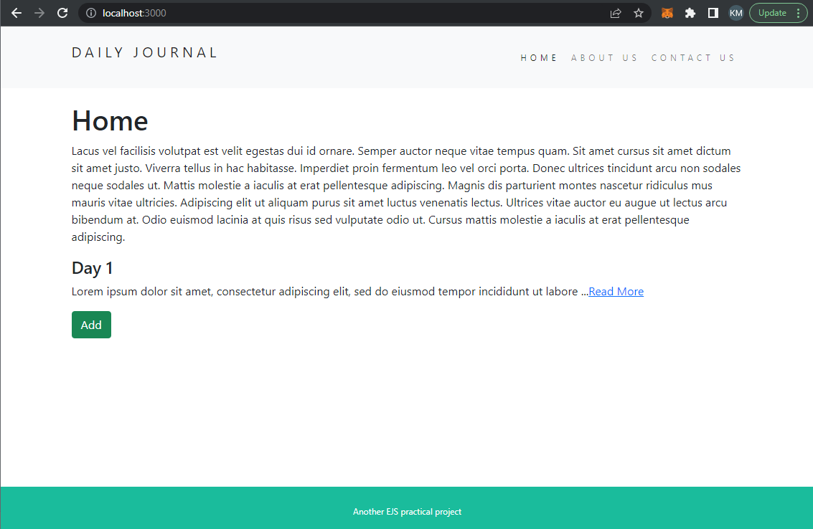
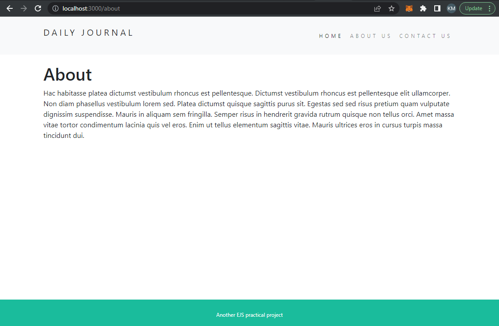
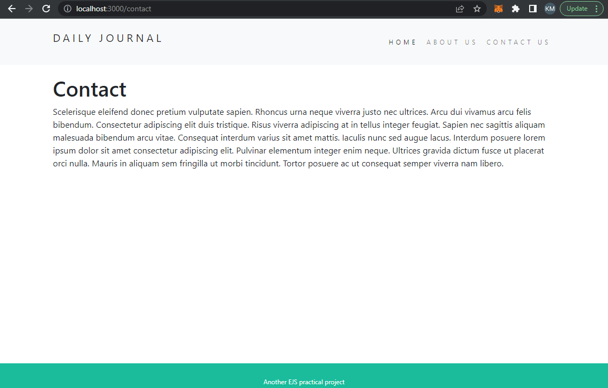
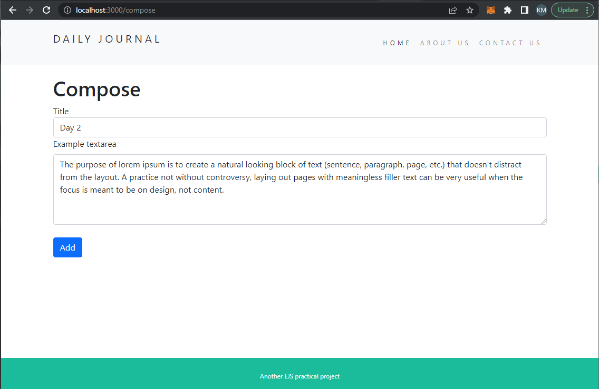
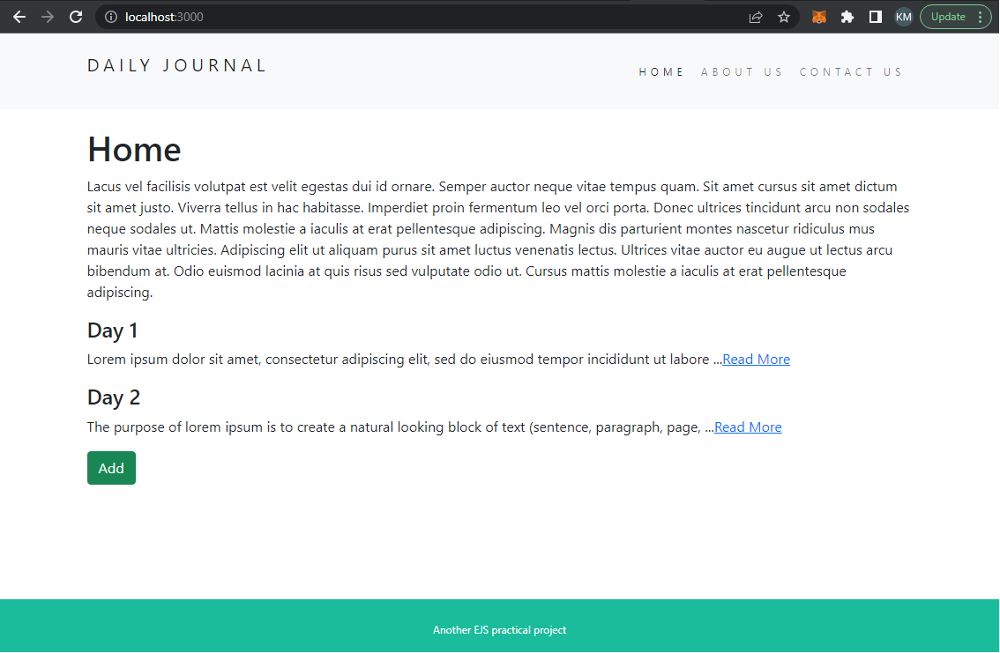
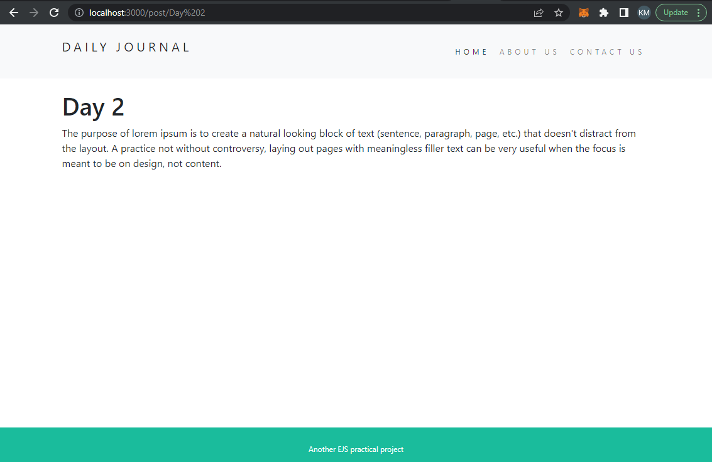

# EJS blog website
> A simple express web server that implement EJS as page template.
> Live demo is available on [Railway](https://ejsblog-production.up.railway.app/) free-tier. 


## Table of Contents
* [General Info](#general-information)
* [Technologies Used](#technologies-used)
* [Features](#features)
* [Screenshots](#screenshots)
* [Setup](#setup)
* [Usage](#usage)
* [Project Status](#project-status)
* [Lesson Learned](#lesson-learned)
* [Room for Improvement](#room-for-improvement)
* [Acknowledgements](#acknowledgements)


## General Information
- The webpage allow user to compose a simple blog with content.
- The homepage of the website will show the first 100 letters of blogs post.
- The post page will show the whole content of the post.
- A practical project created for study and practice


## Technologies Used
- Express: ^4.16.3
- Node: ^14.17.6
- ejs: ^3.1.8
- lodash: ^4.17.21
- mongoose: ^6.6.1


## Features
- Create blog post
- Delete blog post


## Screenshots
- Homepage


- About page


- Contact page


- Compose post page


- Homepage (After)


- Post page



## Setup
- Project environment:
    - [Node.js](https://nodejs.org/en/) installed.
    - [MongoDB Shell](https://www.mongodb.com/docs/mongodb-shell/) installed.
- Cloud Database environment (Optional):
    - Create a mongoDB Atlas account


## Usage
- On project terminal
    - install dependencies `npm install`
    - start the app `npm app.js`
- On Mongodb Shell
    - start the database server `mongosh`
- Or MongoDB Atlas (Optional):
  - Connect to your database via mongoose with the URI of your database (remember to change the information of username,password,clustername and password accordingly)
  - You should be able to get a customized URI from your account
  - For more detailed information and documentation, please visit mongoDB doc website [mongoDB/docs](https://www.mongodb.com/docs/atlas/)
```javascript
mongoose.connect("mongodb+srv://<username>:<password>@<clustername>.mongodb.net/<databasename>?w=majority");
```

## Project Status
Project is: _complete_ 


## Lesson Learned
- Implement EJS template page to simplify the web development process.
- Passing variables through express.
- Use express route parameters for useful purposes.


## Room for Improvement
- ~~Connect to cloud database.~~
- ~~Hosting on other platform other than Heroku.~~

To do:
- ~~Establish connection with cloud database (MongoDB Atlas).~~
- ~~Hosted on Railway.~~


## Acknowledgements
- This project was inspired by Angela Yu.
- This project was based on [this course](https://www.udemy.com/course/the-complete-web-development-bootcamp/) on Udemy.